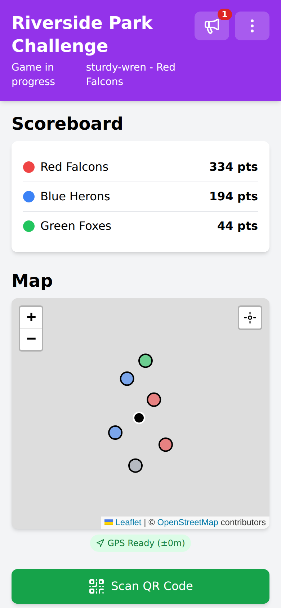

# QR Conquest

A GPS-based team capture game played with printed QR codes. Teams race around a
park, a campus or a town centre, scan the codes they find, and score points for
every minute they hold a base. Everything runs in the phone's browser - there is
no app to install and nothing for a player to type.

It is built for children to play, at schools, youth groups and family events, so
a lot of work has gone into holding as little about them as a game can. There
are no player accounts: no usernames, no passwords, no email addresses. Players
are given a code name rather than asked for a real one, and a game is over in an
hour or two, after which what it holds is of no further use to anybody.



## How a game works

1. **A host prints QR codes** - one per team, one per base - using the built-in
   [code generator](docs/QR-CODES.md).
2. **The host places the base codes** around the play area and scans each one
   where it stands, which records the base's position.
3. **Players scan their team's code** to join. The game issues each player a
   code name like `quiet-badger`; nobody signs up and nobody types anything
   about themselves.
4. **Players capture bases** by walking to them and scanning the code. The
   server checks the scanned code and the player's GPS position, so a base
   cannot be taken from the car park.
5. **Held bases score points** on a timer, so the winning team is the one that
   takes bases early and keeps them.

Two options change the shape of a game. **Quiz capture** puts a question between
a player and a base, and gives every base a shield to wear down. The **bonus
round** ends the game with a scramble to collect the physical QR codes back in,
worth enough points that the last-placed team could still win.

## Documentation

| Document | Who it is for | What is in it |
|----------|---------------|---------------|
| [Playing a game](docs/PLAYING.md) | Players | Joining, the map, capturing bases, quizzes, messages from the host, the bonus round |
| [Hosting a game](docs/HOSTING.md) | Hosts | Planning, placing bases, every game setting, running the game, messaging players, ending it |
| [The question bank](docs/QUESTION-BANK.md) | Hosts using quiz capture | Writing questions, categories, bulk import formats |
| [QR codes](docs/QR-CODES.md) | Hosts | Generating, printing and looking after the physical codes |
| [Deployment](docs/DEPLOYMENT.md) | Whoever runs the server | Installing, HTTPS, production servers, environment variables, upgrades |
| [Site administration](docs/ADMINISTRATION.md) | Site administrators | Host accounts, rotating credentials, exporting and deleting games, retention |
| [Security model](docs/SECURITY.md) | Anyone reviewing the design | What counts as a credential, what the API will and will not serve, known limitations |
| [Legal responsibilities](docs/COMPLIANCE.md) | Whoever runs the server | Online Safety Act and UK GDPR duties that come with a public deployment |
| [Architecture](docs/ARCHITECTURE.md) | Developers | How the server and client fit together, file responsibilities, build tooling |
| [Troubleshooting](docs/TROUBLESHOOTING.md) | Everyone | The problems that actually come up, by role |

## Quick start

```bash
git clone <repository-url>
cd QR-Conquest
pip install -r requirements.txt
export SITE_ADMIN_PASSWORD="choose_something_long"
python flask_app.py
```

Then open `http://localhost:5000`. The database is created on first run as
`qr_game.db` in the working directory.

Cameras need HTTPS in every browser, so scanning only works on `localhost` or
behind TLS - see [Deployment](docs/DEPLOYMENT.md) for the production setup, and
for the GPS simulator that lets you play through a whole game at a desk.

## What it is built on

- **Server**: a single Flask application (`flask_app.py`) over SQLite. No
  message broker, no worker processes, no external services.
- **Client**: vanilla JavaScript, installable as a PWA. Tailwind, Leaflet,
  Lucide, jsQR and QRCode.js are vendored into `static/libs/`, so a slow or
  blocked CDN cannot take the map or the scanner down mid-game.
- **Credentials**: QR codes. There are no player accounts - no usernames, no
  passwords, no email addresses - and no password at all except the site
  administrator's, which lives in an environment variable.
- **Data**: players are known by a server-issued code name, generated fresh for
  each game. A finished game deletes every player position immediately and the
  whole game 30 days later, on a timer the deployment sets.

## Repository layout

| Path | What it holds |
|------|---------------|
| `flask_app.py` | The entire server: API, database schema, live events, retention sweeper |
| `static/index.html` | The page shell, rewritten by the server as it is served |
| `static/core.js` | API calls, authentication state, QR handling, polling and the live socket |
| `static/ui.js` | Player-facing UI: landing page, game view, map, scanner, announcements, privacy notice |
| `static/host.js` | Host panel: game setup, teams, bases, settings, question bank |
| `static/site-admin.js` | Site administration: hosts, games, site settings |
| `static/dev-gps.js` | Developer GPS simulator, inert unless `DEBUG_FEATURES` is set |
| `static/code-generator/` | Standalone printable QR code generator |
| `static/libs/` | Vendored front-end libraries |
| `tools/` | Build tooling: Tailwind config, asset vendoring, icon generator |
| `docs/` | The documentation this README links to |

## Status

Pre-beta, and shaped by running real games rather than by a compatibility
policy. Expect breaking changes; there is no upgrade path between versions
beyond "the database file keeps its shape unless a release says otherwise".

Known limitations are listed in
[Architecture](docs/ARCHITECTURE.md#known-limitations).

## Contributing

Fork, branch, and test with all three roles - player, host and site
administrator - before opening a pull request. The GPS simulator in
[Deployment](docs/DEPLOYMENT.md#testing-without-a-park) makes that possible
without leaving your desk. Describe what you changed and how you exercised it.

## Licence

Provided as-is for educational and entertainment purposes. Respect local laws
and property rights when placing QR codes and running games. See
[LICENSE](LICENSE).
