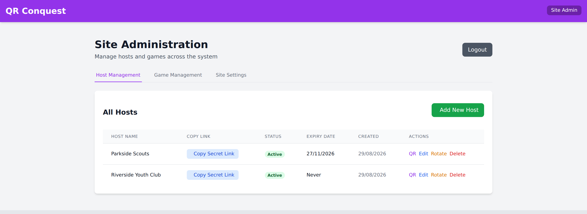
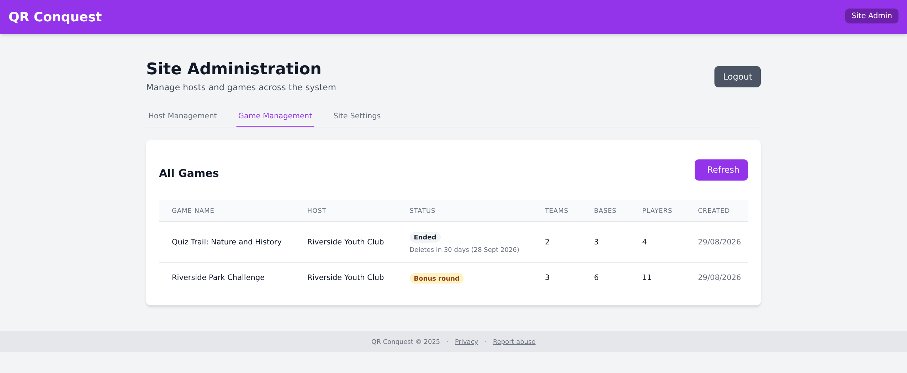

# Site administration

A site administrator runs the deployment: they create the host accounts that let
other people run games, and they are the only person who can export or delete a
game once players have joined it.

Getting the server running is [Deployment](DEPLOYMENT.md). What the job makes
you responsible for, legally, is [Legal responsibilities](COMPLIANCE.md).

## Getting in

Open the menu at the top right of any page, choose **Site administration**, and
enter the password from `SITE_ADMIN_PASSWORD`. There is one administrator
password for the whole site and no administrator accounts; the password is also
the bearer token the admin API checks, so treat it accordingly.

## Host accounts

**Add New Host** creates an account and its secret link. Give the host a name
you will recognise, and an expiry date if their access should lapse on its own -
a volunteer for one weekend does not need a link that works next year.

Each row offers:

| Action | What it does |
|--------|--------------|
| **Copy Secret Link** | The URL that enrols a host's device. Send it to them, or print the **QR** version |
| **QR** | The same credential as a printable code |
| **Edit** | Rename the host or change the expiry date |
| **Rotate** | Replaces *both* of the host's secrets - the QR code they enrol with and the id their device stores afterwards. Their games and question bank move across unchanged; every device signed in as that host is signed out and gets back in by scanning the new code |
| **Delete** | Removes the host account |

**Rotate on any suspicion.** A secret link is a credential in a URL, so it ends
up in browser history, in server access logs, and in whatever chat thread it was
pasted into. Rotating costs the host one scan. Rotate when a link has been
over-shared, when a host's phone is lost, and when a host leaves.
[Security model](SECURITY.md#known-limitation-the-enrolment-link-is-a-url) sets
out where the exposure comes from and why the answer is rotation rather than a
redesign.

## Games

Every game on the site is listed with its host, status, size and creation date.
An ended game also shows when it will be deleted. The table scrolls sideways on
a narrow screen to reach the per-game actions:

- **Complete** ends a running game and releases its QR codes, for when a host has
  gone home without ending it.
- **Export** downloads the whole record of one game as a single JSON file:
  settings, teams and players, bases, the capture timeline, every announcement
  including ones the host withdrew, quiz sessions, and the questions those
  sessions served. Credentials are deliberately left out - no host ids, and none
  of the QR codes that enrol a host, join a team or mark a base - so the file is
  safe to file away.
- **Delete** removes a game and everything in it, permanently. Once players have
  joined, this is the only way a game can be removed; a host cannot do it.

The export is how you answer a complaint or a subject access request, and the
only way to keep a game's record past its retention window. Take it before the
clock runs out.

## Retention

A finished game cleans itself up in two stages:

1. **When it ends.** Every player's stored GPS position is deleted outright,
   along with any quiz cooldown still running. What is kept is the record a
   complaint would be answered from: generated player names, team membership and
   join times, the capture timeline, quiz sessions, and every word the host
   wrote, withdrawn announcements included.
2. **After the retention window.** The game and everything in it is deleted for
   good. Thirty days by default, set by `GAME_RETENTION_DAYS`.

A background sweeper runs hourly, so a server that was switched off over the
window still clears its expired games shortly after it comes back.

Set the window to match the retention schedule you have written for your
deployment, and remember that the privacy notice players read quotes the value
you set.

## Site settings

The **Site Settings** tab holds the address that players and hosts use to report
abuse or complain about a game.

- Enter an address and save. A **Report abuse** link then appears in the footer
  and menu of every page, and under the messages panel for players. It opens
  their email app with the game pre-filled.
- The field overrides the `ABUSE_CONTACT_EMAIL` environment variable without a
  restart; clearing it falls back to that variable.
- With neither set, no reporting route is shown anywhere. Publish one before you
  run games for other people - [Legal responsibilities](COMPLIANCE.md) explains
  why that matters more than it looks.

## What you can and cannot moderate

The design keeps the moderation surface small: players write no free text at
all, there is no player-to-player messaging, and no private channel between a
host and a player. Everything a player reads that is not a number was typed by
their host - the game, team and base names, the announcements, and the quiz
questions.

That leaves you with:

- **Export**, to read everything in a game including withdrawn announcements.
- **Delete**, which removes the whole game.
- **Rotate** and **Delete** on the host account behind it.

You cannot take down a single announcement or rename one base - only the host
can withdraw their own messages. This is a real gap rather than an oversight;
it is recorded in
[Legal responsibilities](COMPLIANCE.md) and in
[Architecture](ARCHITECTURE.md#known-limitations).
