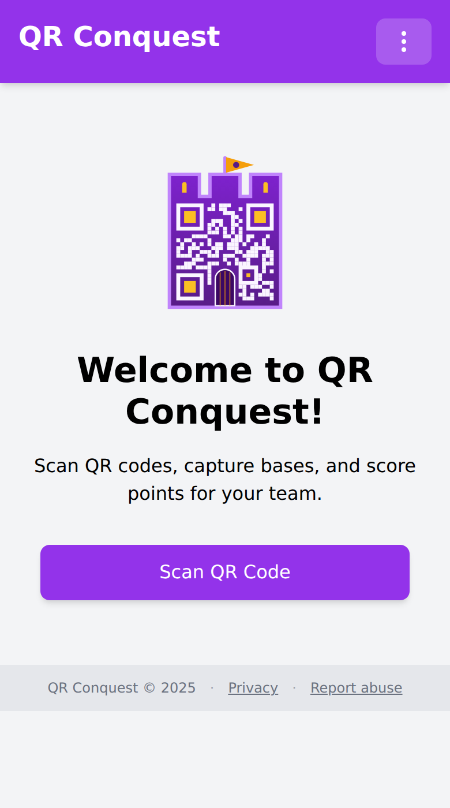

# Deployment

How to run QR Conquest, from a laptop to a public site. Running it for other
people also makes you the provider of a service and the controller of the data
in it - read [Legal responsibilities](COMPLIANCE.md) before you open it up.

## Requirements

- Python 3.9 or newer (Flask 3 needs it; the app itself uses nothing exotic)
- A modern browser with camera access for the people playing
- HTTPS for anything that is not `localhost`: browsers only hand over the camera
  and precise location on a secure origin

Everything else is in the repository. The front-end libraries are vendored into
`static/libs/`, so serving the game needs no Node toolchain and no CDN.

## Running it locally

```bash
git clone <repository-url>
cd QR-Conquest
pip install -r requirements.txt
export SITE_ADMIN_PASSWORD="choose_something_long"
python flask_app.py
```

The app listens on port 5000 and creates `qr_game.db` in the working directory
on first run. Open `http://localhost:5000`, then the menu at the top right and
**Site administration** to create your first host account.



Running `flask_app.py` directly starts Flask's development server with the
debugger and reloader on. That is fine at a desk and unsuitable for anything
public - see [Production](#production) below.

To use a phone against a laptop server, put both on the same network and reach
the laptop by IP. The camera will refuse to open over plain HTTP, so put a TLS
proxy in front of it, or use the GPS simulator instead.

## Testing without a park

Set `DEBUG_FEATURES=true` before starting the server and the client grows two
developer tools:

- **A GPS simulator.** An on-screen panel moves a fake position with arrow
  buttons; right-click the map to teleport, or call `devGPS.set(lat, lng)` from
  the console.
- **A simulated scan box.** Type a code's value to fire the same code path a
  camera scan does.

Between them, the whole game - joining, capture, quiz sessions, cooldowns, the
bonus round - can be played through at a desk. Never set this in production: it
is a developer console and a location spoofer sitting on the player's page.

## Production

### Serve `index.html` through the app, not as a static file

The app rewrites the page shell as it serves it: the abuse-reporting address,
the retention period the privacy notice quotes, the live-socket flag, and the
version stamp that busts the browser cache after a deploy. A static-file mapping
for `/` - a PythonAnywhere static mapping, an nginx `try_files`, a CDN in front
of the app - bypasses all of that and serves the defaults baked into the file.

Map `/static` statically if you like; let `/` reach the WSGI app. To check a
running deployment, view source on the homepage: `window.QRC_ASSET_VERSION`
should carry a number rather than `""`.

### HTTPS

```nginx
server {
    listen 443 ssl;
    server_name your-domain.example;

    ssl_certificate     /path/to/cert.pem;
    ssl_certificate_key /path/to/key.pem;

    location / {
        proxy_pass http://localhost:5000;
        proxy_set_header Host $host;
        proxy_set_header X-Real-IP $remote_addr;

        # Required for the live-events WebSocket (/ws/games/<id>)
        proxy_http_version 1.1;
        proxy_set_header Upgrade $http_upgrade;
        proxy_set_header Connection "upgrade";
        proxy_read_timeout 3600s;
    }
}
```

### An application server

```bash
pip install gunicorn
# Each WebSocket connection holds a thread for its lifetime, so give it a
# generous thread pool. One worker keeps every connection in one process, so
# capture broadcasts reach everyone in a game.
gunicorn -w 1 --threads 100 -b 0.0.0.0:5000 flask_app:app
```

A single worker is not a limitation to work around: the live-event buffer and
the socket registry live in process memory, so a second worker would only see
half the players.

### On a host that serves one request at a time

Shared hosting often runs the app under uWSGI as a single process on a single
core - PythonAnywhere does - which means exactly one request is answered at a
time and everything else queues.

The game still works, because players poll rather than hold a connection, but
the app's own request volume is the whole budget:

- A live game costs roughly one request per player every five seconds.
- The site admin panel reads its games table in one request.
- The live-events WebSocket **cannot connect there at all** - the socket the
  handshake needs is not in uWSGI's WSGI environment. Set `LIVE_EVENT_SOCKET=off`
  so clients do not try. Nothing is lost but a second of latency: the same
  events ride along on the five-second poll. Left on, each client makes a few
  doomed attempts and gives up, costing a handful of requests per page load.

## Environment variables

| Variable | Required | What it does |
|----------|----------|--------------|
| `SITE_ADMIN_PASSWORD` | Yes | The site administrator's password, and the bearer token the admin API checks. There is no other account with this power |
| `ABUSE_CONTACT_EMAIL` | Recommended | The address published to players and hosts behind "Report abuse". A site administrator can override it under Site Settings without a restart; with neither set, no reporting route is shown at all |
| `GAME_RETENTION_DAYS` | No | Days after a game ends before it and everything in it is deleted. Defaults to 30. A value below 1 is ignored with a warning. The privacy notice players read quotes this value, so it stays true whatever you set |
| `LIVE_EVENT_SOCKET` | No | `off` stops clients opening the live-events WebSocket. On by default. Set it off on a host that cannot carry one (uWSGI) |
| `DEBUG_FEATURES` | No | `true` exposes the GPS simulator and a mobile debug console in the client. Never in production |

The app reads no other environment variables. In particular `FLASK_ENV` and
`FLASK_DEBUG` do nothing here: `python flask_app.py` always starts the
development server in debug mode, and a production WSGI server never reaches
that line.

## Keeping the deployment fed

- **The database** is a single SQLite file, `qr_game.db`, in the working
  directory. Backing it up is copying that file; it holds every game, host
  credential and question bank.
- **Retention runs itself.** A background sweeper checks hourly for games past
  their retention window, so a restarted server never sits on expired data.
- **After a deploy**, every asset URL is stamped with the newest modification
  time under `static/`, so browsers fetch the new files instead of reusing
  months-old ones. There is no service worker to unregister; a hard reload is
  enough if a client still looks stale.
- **If you change front-end classes**, rebuild the stylesheet - see
  [Architecture](ARCHITECTURE.md#front-end-libraries). Nothing else needs a
  build step.

## Health check

`GET /api/health-check` answers `{"status": "ok"}` without touching the
database. Use it for uptime monitoring.
