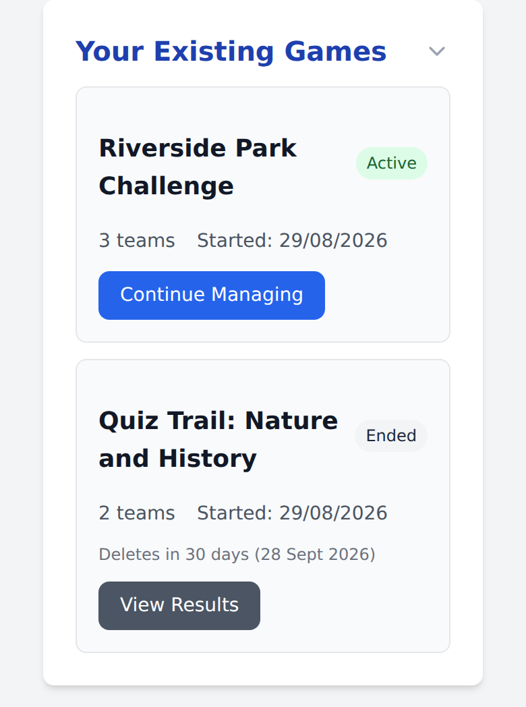
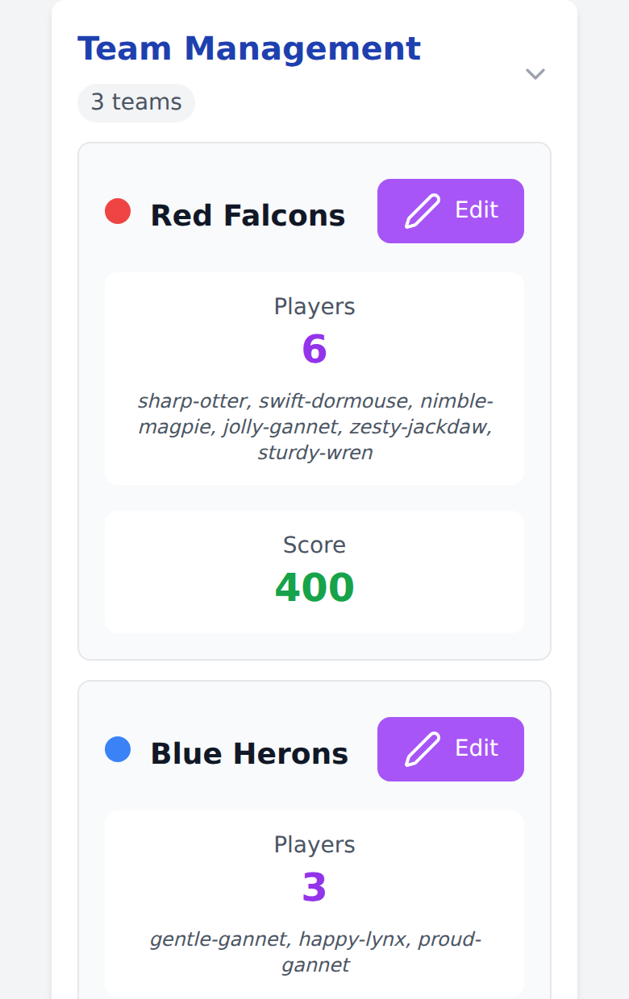
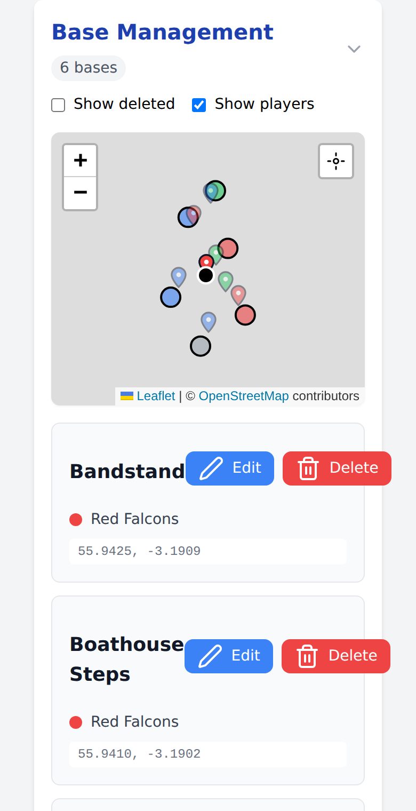
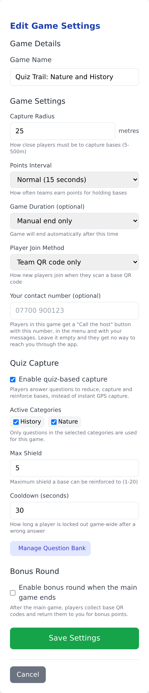
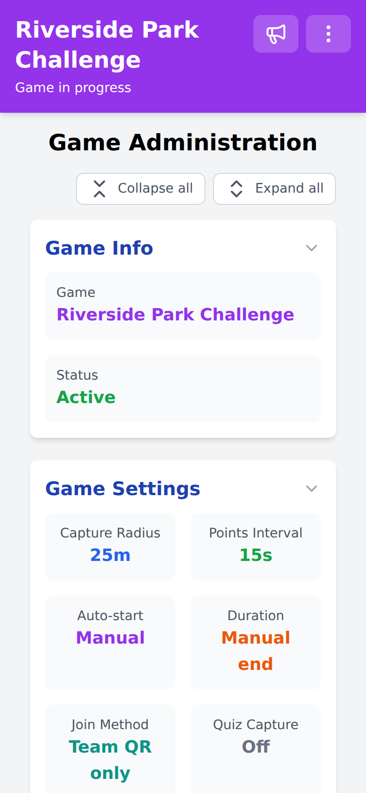
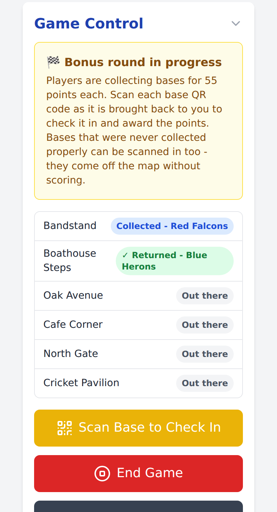

# Hosting a game

As a host you build the game, place the bases, and run the whole thing from your
phone. This page follows a game from planning to the final scoreboard.

- [Before the day](#before-the-day)
- [Setting the game up](#setting-the-game-up)
- [Game settings](#game-settings)
- [Running the game](#running-the-game)
- [Talking to your players](#talking-to-your-players)
- [Quiz capture](#quiz-capture)
- [The bonus round](#the-bonus-round)
- [Ending a game](#ending-a-game)

## Before the day

### Get your host access

A site administrator creates your host account and sends you a secret link.
Opening that link on your phone enrols it as a host and keeps it signed in. The
link is the credential - treat it like a password, and do not forward it. If it
does get out, ask your administrator to **Rotate** it: you scan a new code once
and everything you have built moves across.

Once enrolled, the host panel is behind the menu icon at the top right of every
page, under **Host menu**.

### Count and print your codes

You need one code per team and one per base, plus a few spares. Ten bases and
three teams is a comfortable first game; there is no hard limit, but 2-6 teams
and 10-30 bases have worked in the past.

Print them from the built-in generator - **Print QR Codes** in the host panel,
or `/code-generator/` directly. [QR codes](QR-CODES.md) covers the layouts,
styles, and how to make codes survive an afternoon outdoors.

A code is blank until you scan it into a game, so print in bulk and decide what
each one is on the day.

### Walk the route

Pick base locations that are reachable on foot, safe to stand at, and far enough
apart that a team cannot hold two at once. Consider where GPS struggles - deep
tree cover, tall buildings, underpasses - and either avoid those spots or plan
to raise the capture radius.

## Setting the game up

### Create the game

From the host panel, fill in **Create New Game**: a name, and any settings you
want to change from their defaults. The name is how the game is identified
everywhere you and your players see it.

Everything except the game name can be changed later, until the phase that locks
it in - so it is fine to create the game and tune the settings once you see how
the site plays.

### Add teams

Open **Scan QR Code**, scan a printed code, and choose **Assign as Team**. Give
the team a name and pick a colour. Repeat for each team; you need at least two
before the game can start.

- **Edit** renames a team or changes its colour at any time, including mid-game.
- A team nobody has joined can be deleted, during setup or mid-game, so a spare
  team does not sit on the scoreboard with zero points. Its QR code is freed for
  reuse as another team or a base.

### Place bases

For each base: go to the spot, put the printed code where players will find it,
and scan it there. Choose **Assign as Base** and give it a name players will
recognise - "Bandstand", "Library Steps", "Main Gate". Your GPS position at the
moment you scan is the base's position, so scan while standing at the marker
rather than back at the gate.

*Map tiles are left out of the screenshots in these pages; in play the circles
and pins sit on an OpenStreetMap backdrop.*

- Bases appear on the map immediately, for you and for everyone in the game.
- **Edit** renames a base or corrects its position.
- **Delete** takes a base out of play - use it when a code is stolen or a spot
  turns out to be unsafe. It is reversible: tick **Show deleted**, choose
  **Restore**, and scan a code (the original, or a fresh one if the first is
  gone). The base comes back with its captures and points intact.

## Game settings

Set when you create a game, and editable from **Edit Settings** until the
relevant phase locks them in.

| Setting | Default | Range | What it does |
|---------|---------|-------|--------------|
| Capture radius | 15 m | 5-500 m | How close a player must be to capture or collect a base. The server checks it; the client cannot overrule it |
| Points interval | 15 s | 5 s - 1 h | How often each held base earns its team a point |
| Auto-start time | Off | Any future time | Starts the game for you at a set time |
| Game duration | Manual end | 5 min - 30 days | Ends the game automatically. Must be at least 10x the points interval |
| Player join method | Team QR only | - | Scan a team code, pick a team from a list, or auto-assign to the team with fewest players or the lowest score |
| Your contact number | Empty | - | Published to the players in this game as a "Call the host" button. Leave it empty and they get no route back to you through the app |
| Quiz capture | Off | - | Capture by answering questions instead of by scanning alone. Requires at least one question category with active questions |
| Max shield | 5 | 1-20 | Quiz capture: the most a base can be reinforced to |
| Wrong-answer cooldown | 30 s | 5-3600 s | Quiz capture: how long a wrong answer locks that player out of answering anywhere in the game |
| Bonus round | Off | - | Ends the main game with a collect-the-bases phase instead of stopping outright |
| Bonus points per base | Auto | 1-1,000,000 | Auto sizes the value when the bonus round starts, so the last-placed team could win by collecting every base. Locked once the bonus round begins |

Pick the capture radius for the worst GPS on the site, not the best. Fifteen
metres is fine in the open; under trees or between buildings, 25-40 m saves a
lot of standing around.

## Running the game

Start the game from **Game Control** once your teams are formed. From then on
the host panel is a live view of the whole game.

- **Fold sections away** by tapping a heading. A game with five teams and
  twenty-six bases is a long page otherwise. **Collapse all** and **Expand all**
  do the lot, and the team and base headings carry a count so you can see what
  is inside a folded section. What you fold stays folded on that device.
- **Teams** show their player count, the code names the game gave those players,
  and their live score. Players are never asked for a real name - the game is
  built for children, so it issues an `adjective-animal` code name instead. It
  is there to tell one player from another on this roster, and to give you
  something to refer to if a question comes up afterwards; it is not a way of
  knowing who anybody is, and a player gets a different one in every game they
  join. If you need to match a code name to a child, do it from your own
  register on the day.
- **Bases** show who holds each one - and, in a quiz game, its shield.
- **Your map** shows the last known position of every player as a pin in their
  team's colour, with bases as circles so the two never get confused. Positions
  that have not updated in five minutes are faded, and each pin's popup names
  the player, their team, and when they were last seen. The **Show players** tick
  box takes the pins off when a crowd of them hides the bases; the setting
  sticks between visits.

Player positions exist so you can spot a team that has drifted out of the play
area or a player who has gone quiet. They are served to you and to nobody else -
not to other players, and not to an anonymous caller - and every one of them is
deleted the moment the game ends. Nothing about a game is meant to outlive it by
much: the game itself is deleted automatically a few weeks later, and your game
list shows the date for each ended game.

## Talking to your players

The megaphone icon in the header opens the composer, from any page including the
host panel. A message reaches everyone in the game as a notification and stays in
a list they can scroll back through.

- It is one-way and one-to-many by design. There is no way to message a single
  player or team, and no reply channel. That keeps a private line between a host
  and a player - who may well be a child - out of the design entirely. The
  reasoning is in [Legal responsibilities](COMPLIANCE.md).
- Sent the wrong thing? The bin icon on a message withdraws it from every
  player's list, though anyone who has already read it has read it.
- Messaging works before the game starts and after it ends, so you can brief
  everyone and then call them back in.
- Because players cannot reach you in the app, give them a way to reach you
  outside it. Filling in **Your contact number** in the game settings gives the
  players in that game a "Call the host" button; it rings your phone and the app
  records nothing about the call. If you would rather not publish a number, put
  one on the team sheet instead.

## Quiz capture

Quiz capture turns each base into a small contest. Instead of capturing on a
scan, a player is served a question, and bases carry a shield that has to be worn
down before they change hands.

To use it:

1. Build a [question bank](QUESTION-BANK.md) from your host panel. It belongs to
   your host account, not to one game, so you build it once and reuse it.
2. In the game settings, tick **Enable quiz-based capture** and choose which
   categories are in play. One bank can serve a family event and a pub quiz by
   keeping the two audiences in separate categories.
3. Set the **max shield** and the **wrong-answer cooldown**.

A game cannot start with quiz capture enabled unless at least one selected
category contains at least one active question. Questions can be edited, enabled
and disabled mid-game - answers are always marked against the latest saved
version - so a mistake in a question can be fixed without stopping play.

## The bonus round

Turn **Bonus round** on and the end of the main game becomes a scramble to get
the physical codes back.

When the main game ends - on its timer, or when you press **End Game** - base
scoring freezes and players are told to collect the bases:

1. A player scans a base **at its location** to mark it collected. It disappears
   from everyone's map, so nobody hunts for a base that has already gone.
2. They bring the code back to you.
3. You scan it with **Scan Base to Check In**. Only then does the collecting team
   score the bonus points.

The checklist in Game Control shows every base as **Out there**, **Collected**,
or **Returned**, so you can see at a glance what is still in the field.

Any base code in your hand can be scanned in - one that was never marked
collected, or one belonging to a base you deleted. It comes off the map so
players stop looking for it, but scores nothing.

Points per base can be set by hand or left on automatic, in which case the value
is chosen when the bonus round starts so that the last-placed team would win by
collecting everything. Ending the game finishes the bonus round and releases all
the QR codes as usual.

## Ending a game

**End Game** stops play, freezes the scoreboard and releases every QR code in the
game for reuse. It also deletes every stored player position immediately.

After that:

- The game stays in your list as **Ended**, with **View Results**, and the card
  says when it will be deleted - 30 days after it ended on a default deployment.
- You cannot delete a game players have joined: it holds their data and its own
  history, so removing it takes a site administrator. A game nobody joined - a
  mis-scanned setup, or one that never ran - you can delete yourself.
- If you need a copy of a finished game, ask your site administrator to export
  it before the retention window runs out. After that it is gone.

## When something goes wrong

Common problems - a game that will not start, players who cannot join, captures
that will not register - are in [Troubleshooting](TROUBLESHOOTING.md).
