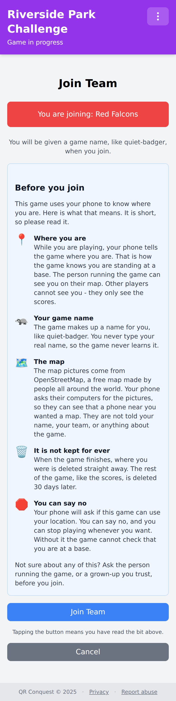
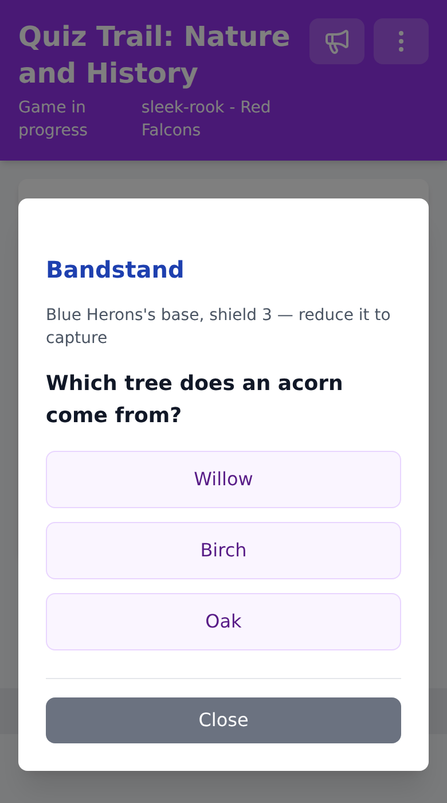
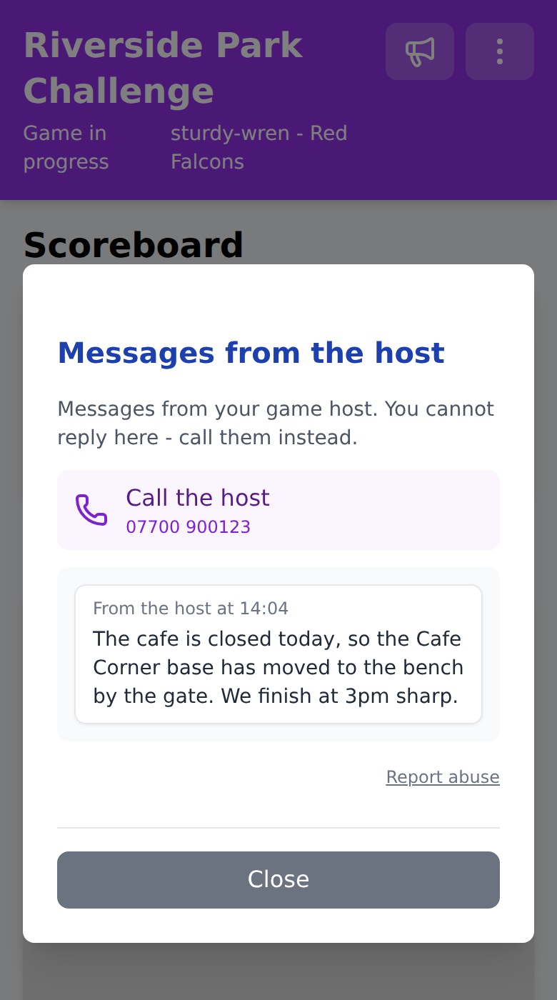
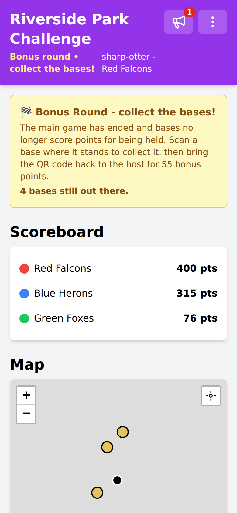
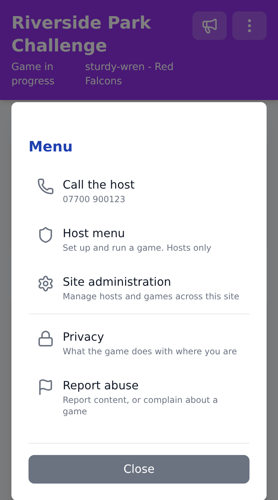

# Playing a game

Everything you need is a phone with a camera and a browser. There is no app to
download, no account to create, and nothing to type about yourself.

## Joining your team

Your host or team captain hands you a QR code - usually printed on a team sheet.
Scan it with your phone's camera and the join page opens.

Before the page asks your phone for your location, it tells you what the game
does with it: who can see where you are, the name the game gives you, where the
map pictures come from, and how long anything is kept. The **Privacy** link in
the footer brings that notice back at any time.

Tap **Join Team** and you are in. The game gives you a name like `quiet-badger` -
you never type one, so the game never learns your real name.

If your host has set the game up to let players choose, you may see a list of
teams instead of needing a code. Which way it works is the host's choice.

### Install it for better GPS

If your browser offers to install QR Conquest to your home screen, take it. An
installed app gets steadier GPS from the phone than a browser tab does, which
matters when you are standing at a base waiting for a capture to register.

## Your game screen

*Map tiles are left out of the screenshots in these pages. In play, the bases
and your own position sit on top of an OpenStreetMap backdrop.*

- **Scoreboard** - every team and its current score, updated as the game runs.
- **Map** - each base as a circle in the colour of the team that holds it, grey
  if nobody has taken it yet. Tap a base for its name and owner.
- **You** - the black arrowhead. It points the way you are travelling once you
  start moving. Tap the crosshair button to jump back to yourself if you have
  panned the map away.
- **Scan QR Code** - opens the camera to capture a base. If the camera will not
  play ball, the scanner has a box to type the code in by hand.

Your latest position is sent to your host while you play, so they can see where
everyone is. Only the host sees it, only your most recent position is kept -
never a trail of where you have been - and it is deleted the moment the game
ends.

## Capturing bases

Walk to a base, find the printed code, and scan it. Two things have to be true
for the capture to count:

- **The code has to be the right one.** Scanning a photo of a base code from
  somewhere else does nothing.
- **You have to be there.** The server checks your GPS position against the
  base's, inside the radius your host set - 15 metres by default, and often
  more where tree cover makes GPS wander.

A captured base turns your team's colour and starts earning points. Teams score
for every interval they hold a base - 15 seconds by default - so taking a base
early and keeping it beats sprinting between them.

Everyone in the game sees a notification whenever any team captures a base, so
you will know when one of yours has been taken.

## Quiz capture

If your host has turned quiz capture on, scanning a base opens a question
instead of capturing it outright.

- Every base has a **shield**. A correct answer at an enemy base knocks a point
  off its shield; when the shield reaches zero the base is neutral, and one more
  correct answer takes it for your team.
- A correct answer at **your own** base reinforces it, up to the maximum your
  host set, making it harder for anyone else to take.
- A **wrong answer** ends your turn and locks you out of answering anywhere in
  the game for a cooldown - 30 seconds by default. The app shows the countdown.
- The base's current shield is shown when you tap it on the map, so your team
  can see which bases are worth attacking before walking to them.

Answers are checked on the server, so a right answer is a right answer whatever
the phone thinks.

## Messages from your host

Your host can send a message to everyone playing - a start time, a change of
plan, a base that has blown into a hedge. New messages arrive as a notification,
and the megaphone icon in the header carries a count until you have read them.

Messaging is deliberately one-way. Nobody can message you individually, you
cannot reply in the app, and players cannot message each other. If your host
published a contact number, you get a **Call the host** button - in the menu and
at the top of the messages panel. If they did not, use whatever contact details
they gave you off the app.

## The bonus round

Some games end with a bonus round instead of simply stopping.

- Held bases stop scoring, and the hunt begins.
- Race to a base and scan it **where it stands** to collect it. A collected base
  disappears from everyone's map, so nobody wastes time hunting for it.
- Bring the physical QR code back to your host. The points are only awarded when
  the host scans it back in.
- Every base is worth the same fixed number of points, sized so that even the
  last-placed team could win by collecting them all.

If the bonus round starts while you are mid-question, your answer no longer
affects the base and a wrong answer costs you no cooldown - the app tells you to
go and collect the base instead.

## Reporting something

If a message from your host, or a game, team or base name, is abusive - or you
want to complain about how a game is being run - use the **Report abuse** link.
It is in the footer and the menu of every page, and under the messages panel.

The link gives you the address of the administrator who runs the site, not your
game host, and opens your email app with the game already filled in. It only
appears if the site has published an address.

## When something is not working

- **The camera will not open**: the site has to be on HTTPS for any browser to
  hand over the camera, and you may have said no to the permission prompt.
  Check the site permissions in your browser settings, or type the code in by
  hand using the box under the scanner.
- **A capture will not register**: give the GPS a few seconds to settle,
  particularly under trees or between buildings, and make sure you are standing
  at the base rather than looking at it from across the path. Installing the app
  to your home screen usually helps.
- **The map is blank**: it needs a data connection to fetch map pictures. The
  game itself still works - bases and scores come from the game server, not the
  map.

More, including what a host can do about it, is in
[Troubleshooting](TROUBLESHOOTING.md).
