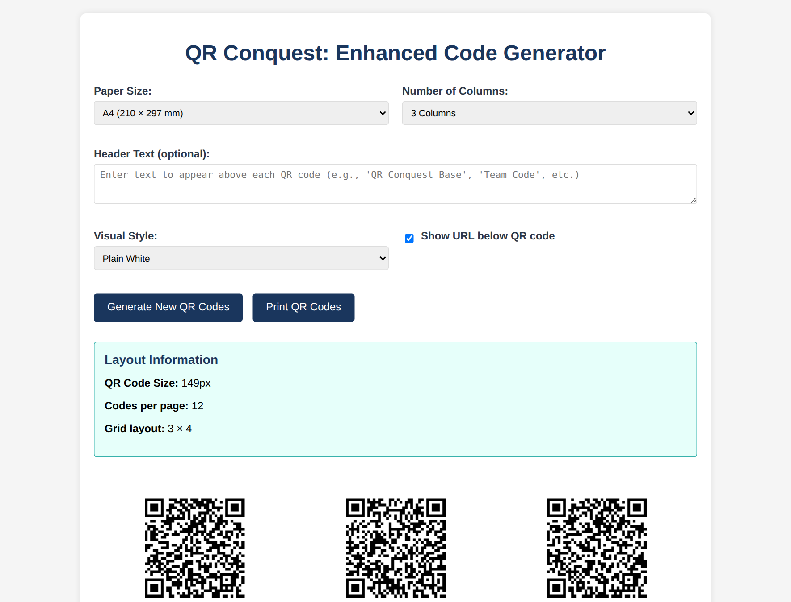

# QR codes

Every game runs on printed QR codes: one per team, one per base. They are
generated blank - a code becomes a team or a base only when a host scans it into
a game - so you can print a sheet in advance and decide what each one is on the
day.

## The generator

Reach it either way:

- **From the host panel**: **Print QR Codes** under QR Code Management.
- **Directly**: `/code-generator/` on your QR Conquest site. It needs no host
  login, so someone else can do the printing for you.

### Layout

| Option | Choices |
|--------|---------|
| Paper size | A4, Letter, A3, Tabloid |
| Columns | 2 to 6, with rows calculated to fill the page |
| Header text | Optional text above every code on the page, e.g. "Team code" or "Riverside game" |
| Show URL | Prints the code's URL underneath, so a code can be typed in if a camera fails |

The panel tells you the resulting code size and how many fit on a page - twelve
per A4 sheet at three columns, for example.

### Visual style

| Style | Use |
|-------|-----|
| Plain white | Ordinary printing, least ink |
| Black border | Easier to spot on a cluttered noticeboard |
| Orienteering flag | Orange and white flag pattern, so bases read as controls at a distance |
| Custom colours | Your own background and border colours |

### What is in a code

- Each code carries a URL in the form `https://yoursite.example/?id=<code>`,
  where `<code>` is a random 11-character identifier.
- Codes are generated at the highest QR error-correction level, so a code that
  is scuffed, rained on or partly obscured usually still scans.
- The identifier means nothing until a host scans it into a game. Two codes are
  never the same, and a code can only be one thing at a time - a team, a base or
  a host - within the site.

Print from the browser. There is nothing to install and no plugin.

## Preparing codes for a game

1. **Print more than you need.** Codes get rained on, blown away and taken home
   as souvenirs. A few spares mean a lost base can be restored mid-game.
2. **Label them as you print.** The header text is the easiest way to keep a
   team pile and a base pile apart.
3. **Protect them.** Laminate, or use a punched pocket and cable ties, for
   anything outdoors. A wet inkjet code stops scanning within minutes of rain.
4. **Mount them where a phone can reach.** Roughly chest height, out of direct
   glare, and not behind glass that reflects a torch.
5. **Place bases thoughtfully.** Findable but not obvious, safe to stand at, and
   away from the worst GPS spots on the site - deep tree cover, tall buildings,
   underpasses.

## Handing out team codes

- One code per team, given to the captain or shown to the group.
- Keep a digital copy: photographing the sheet before the game means you can
  re-send a team code to a straggler.
- A team code lets anyone who has it join that team, so treat it as you would a
  ticket - it is not a secret worth much, but it is worth keeping to the team.

## Reusing codes

Ending a game releases every code it used, so the same printed sheet can run
next week's game. Deleting a team nobody joined frees its code immediately.

A code that is still assigned to a live game will be refused when scanned into a
new one, with a message saying what it is already being used for.
