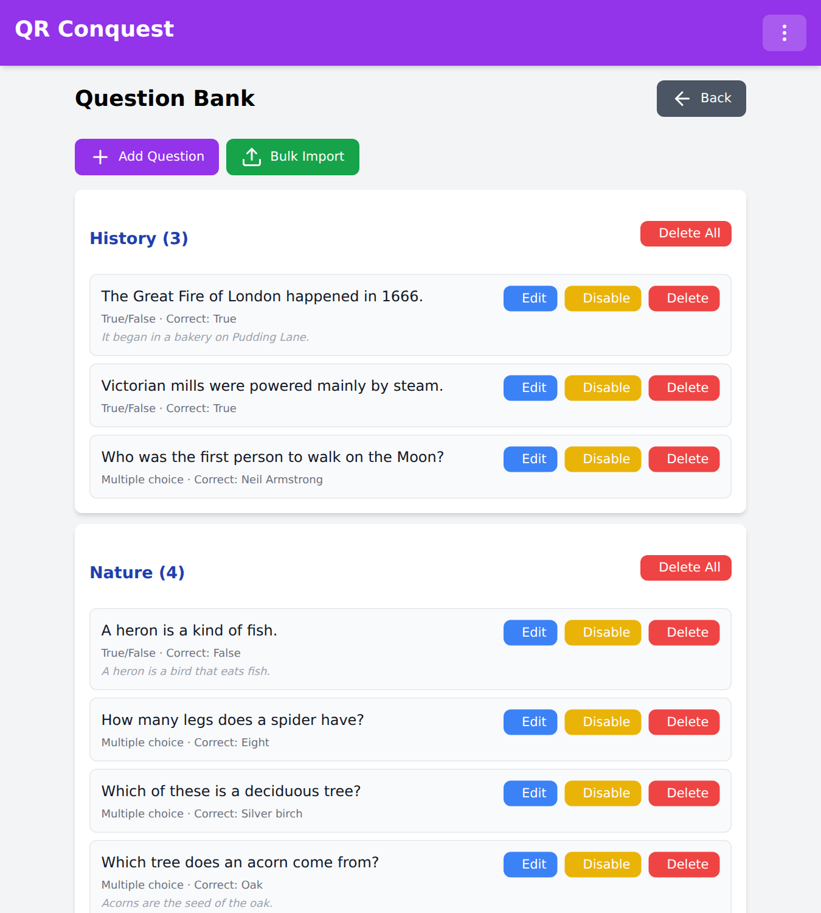

# The question bank

The question bank powers [quiz capture](HOSTING.md#quiz-capture). It belongs to
your host account rather than to any single game: build it once and reuse it
across every game you run. Open it with **Manage Question Bank** on your host
panel.



## How questions are organised

Every question has:

| Field | Description |
|-------|-------------|
| Text | The question shown to the player |
| Type | Multiple choice (`mc`) or true/false (`tf`) |
| Options | The answer choices. Multiple choice only - true/false always shows True and False |
| Correct answer | The option that captures, neutralises or reinforces the base |
| Category | A free-text label used to group questions, for example "Nature", "History" or "Ages 5-8" |
| Explanation | Optional text shown to the player after they answer, right or wrong |

Categories are the unit of selection: when you turn quiz capture on for a game,
you choose which categories are in play. That lets one bank serve different
audiences - a "Kids" category for a family event, a "Pub Quiz" category for an
adults' game - without maintaining two banks.

## How questions are served during a game

- When a player scans a base, the server picks a random question from your
  **active** questions in the game's selected categories.
- Within a single scan session, the server avoids repeating a question that
  player has already been served, as long as the pool is big enough.
- The correct answer is never sent to the player's device. Answers are checked
  on the server.
- A game cannot start with quiz capture enabled unless at least one selected
  category contains at least one active question.

## Managing questions

Each question card offers:

- **Edit** - change any field. Edits apply immediately, and answers are always
  marked against the latest saved version, so a mistake can be corrected even
  mid-game.
- **Disable** / **Enable** - a disabled question stays in the bank but is never
  served. Use it to pull a question you have spotted a problem with, without
  losing it.
- **Delete** - permanent. Each category header also has **Delete All** for the
  whole category at once.

Deletion is blocked while a running game - active, or in its bonus round - is
using the question's category, because a question already on a player's screen
has to stay answerable. Disable it instead, or delete it once the game ends.
Bulk deletes skip in-use questions and report how many were skipped.

## Importing a bank

**Bulk Import** accepts an existing question set as JSON or CSV - paste it into
the import box. Rows are validated one at a time: valid rows are imported,
invalid rows are skipped, and the report lists each skipped row with the reason,
so one bad row never blocks the rest.

### JSON

An array of question objects:

```json
[
  {
    "text": "What is the capital of France?",
    "type": "mc",
    "options": ["Paris", "London", "Berlin"],
    "correct": 0,
    "category": "Geography",
    "explanation": "Paris has been France's capital since 987."
  },
  {
    "text": "The Pacific is the largest ocean.",
    "type": "tf",
    "correct": true,
    "category": "Geography"
  }
]
```

### CSV

A header row, then one question per line. Options are separated with `|`:

```csv
text,type,options,correct,category,explanation
What is the capital of France?,mc,Paris|London|Berlin,Paris,Geography,Paris has been France's capital since 987.
The Pacific is the largest ocean.,tf,,true,Geography,
```

### Field rules

These apply to both formats.

| Field | Required | Rules |
|-------|----------|-------|
| `text` | Yes | Any non-empty text |
| `type` | Yes | `mc` (multiple choice) or `tf` (true/false) |
| `options` | For `mc` | At least two non-blank options. JSON: an array of strings. CSV: pipe-separated (`Paris\|London\|Berlin`). Leave empty for `tf` |
| `correct` | Yes | For `mc`: either the zero-based index of the correct option (`0` for the first) or the exact text of exactly one option, case-insensitive. For `tf`: `true` or `false` |
| `category` | Yes | Any non-empty text. Creates the category if it does not exist yet |
| `explanation` | No | Shown to the player after they answer |

Tips:

- If a question's text contains commas, use JSON, or quote the CSV field:
  `"Which is bigger, the Sun or the Moon?"`.
- Imported questions are active immediately. Importing a category you do not
  want in play yet is fine - just do not select it in the game settings.
- Spreadsheets export CSV directly, so a bank can live in Excel or Google Sheets
  with the columns above and be pasted in whenever it changes.
